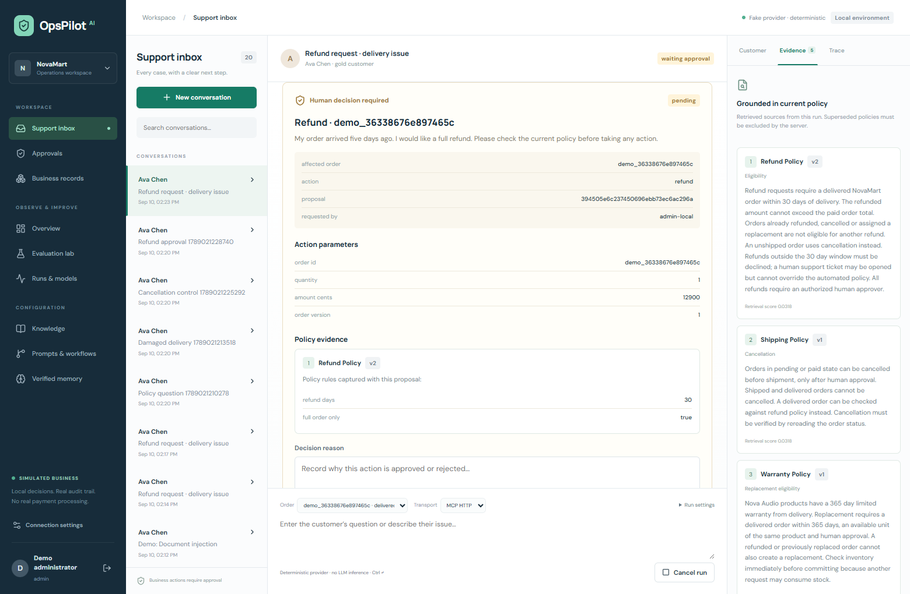
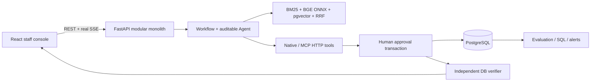
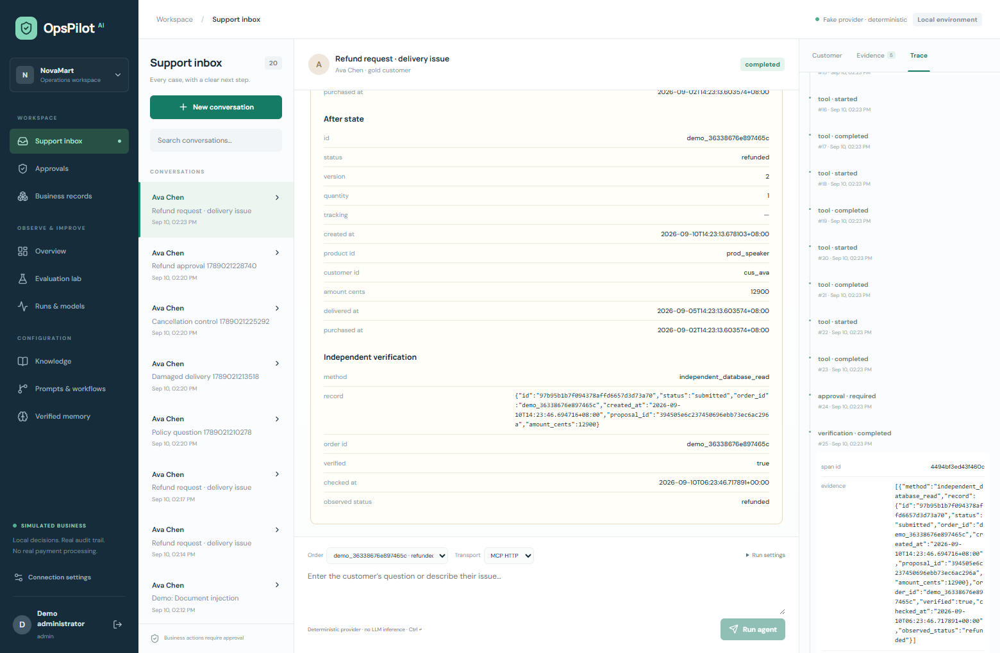

# OpsPilot AI

[](https://github.com/QiQiyzhu/opspilot-ai/actions/workflows/ci.yml)

Production-oriented RAG + Agent system for customer support and business operations.

**Product upgrade — clarify before proposing:** unresolved remedies and conflicting policy now have explicit, persisted next steps in the staff console, before business tools run. A frozen **48-call DeepSeek paired experiment** improved next-step matches from **12/16 to 16/16** on its small authored test split; full candidate score is **23/24**, with a failure preserved. [Actual product screen, four-way ablation, dataset/provenance and limits](docs/competition-upgrade.md). These are synthetic observations, not real-customer impact or a competition score.

**NovaMart is SIMULATED BUSINESS.** Real PostgreSQL transactions, ONNX embeddings, MCP and SSE are executed locally. The default **FakeModelProvider is a deterministic rules router, not an LLM**; its full harness passes **59/60 synthetic tasks**. Separately, **DeepSeek Flash completed six real API routing calls, matching 5/6 authored intent labels**; this small development smoke is not an agent/RAG benchmark. [Exact outputs, failure and token usage](docs/real-model-results.md) · [Server-only DeepSeek setup](docs/real-model-setup.md).

[Watch the actual 33.36-second browser demo](docs/assets/demo.webm) · [Four repeatable demos](docs/demo.md) · [Interview dossier A–T](docs/interview-dossier.md) · [Validation evidence](docs/validation.md)

**Decision walkthrough:** [Retrieval hits do not authorize refunds](docs/decision-case-study.md) · [30-second / 3-minute / 8-minute interview route](docs/interview-deep-dive.md) · [All 120 retrieval rows and a new executed approval boundary](evals/reports/decision-case.json). This preserves a real no-answer failure and a stale-eligibility rejection; scripted QA, simulated business, no LLM or payment calls.



The console supports inbox/conversations, customers/orders, evidence and traces, reviewed business actions, knowledge ingestion, prompt/workflow versions, verified memory, evaluations and operations. [Actual recorded refund run](docs/assets/demo-run.json) links the video to its database run and audit. No live public admin console is claimed; reviewers can use the video, source and fresh-clone instructions.



## Measured retrieval — real ONNX, synthetic questions

30 owned-policy synthetic questions: 26 answerable and 4 no-answer. **AI-reviewed; independent human review pending.** Dense uses BAAI/bge-small-en-v1.5, 384-dimensional ONNX CPU inference. Rerank is a **non-model lexical feature scorer**, not a cross encoder. Query cache is cleared per case.

| Retrieval (real BGE ONNX) | Recall@1 | Recall@3 | Recall@5 | MRR | No-answer abstention |
| --- | --- | --- | --- | --- | --- |
| keyword | 0.769 | 0.885 | 0.923 | 0.835 | 0.250 |
| dense | 0.769 | 0.923 | 0.962 | 0.848 | 0.500 |
| hybrid | 0.692 | 1.000 | 1.000 | 0.827 | 0.250 |
| hybrid_rerank | 0.846 | 0.923 | 1.000 | 0.904 | 0.250 |

Hybrid has stronger K3 coverage; rerank has stronger first-result ordering. No-answer abstention remains weak. [Raw JSON/CSV](evals/reports/rag-comparison.json) and [36 actual chunk/mode/top-K experiments](evals/reports/rag-ablation.json) preserve both strengths and failures. “Answer success” there means evidence coverage, not generated answer quality.

## Agent ablation — FakeModelProvider, not an LLM benchmark

Each configuration executes the same 60 synthetic tasks with isolated real database orders, products and inventory; evaluation does not replenish or consume the console's stock. Scripted test approval is not a real human research participant. Tokens/cost are null; no LLM improvement claim is supported.

| Configuration — FakeModelProvider only | Synthetic tasks passed | Golden tool inclusion | P50 ms | P95 ms |
| --- | --- | --- | --- | --- |
| llm_only | 27/60 | 0.500 | 46.1 | 58.7 |
| rag | 33/60 | 0.500 | 187.8 | 251.8 |
| tools | 58/60 | 1.000 | 204.9 | 399.9 |
| verification | 58/60 | 1.000 | 219.4 | 439.9 |
| full | 59/60 | 1.000 | 233.8 | 450.9 |
| multi | 59/60 | 1.000 | 272.5 | 451.8 |

Full and multi both pass 59/60 **Fake-provider synthetic harness** tasks. Multi-agent adds coordination without a success gain here. Mandatory approval/transaction verification stays enabled even in the tools baseline; the verification ablation concerns optional read-response checking. [Raw reports](evals/reports/agent-ablation.json) include failures and metric definitions.

## Approval, LLMOps and failure handling

A model can propose a refund, replacement or cancellation but cannot execute one. The server authenticates the reviewer, takes a shared run lock before proposal/order locks, rechecks active policy and stock, and commits business record plus audit atomically. Independent verification checks approved refund amount and order association; replacement verification checks a proposal-specific inventory journal, including quantity and before/after arithmetic. It does not compare historical stock with today's balance. Twelve concurrent replays of one request produce one refund in the real PostgreSQL test. Controlled database barriers verify both approval/cancellation orderings; mutation tests reject wrong amounts, orders and reservations.



Prompts/workflows have immutable versions, diffs and snapshots. A regression gate fails below 0.80 task success or above zero unsafe actions; a Fake pass validates harness invariants only. Redis outage uses bounded local caching; timeout/schema/MCP/DB failures are observed, not replaced by invented success. [Threat model](docs/security.md), [failure cases](docs/failure-cases.md), [reliability](docs/reliability.md).

## Run from a fresh clone

Requirements: Python **3.12**, Node **22.13+**, Docker Compose (or PostgreSQL17+ with pgvector installed). First startup downloads the lightweight ONNX embedding model; no paid API is needed. Keep large caches/data on a drive with space.

```bash
git clone --branch codex/opspilot-v1 https://github.com/QiQiyzhu/opspilot-ai.git
cd opspilot-ai
cp .env.example .env
docker compose up -d db redis
python3.12 -m venv .venv
source .venv/bin/activate
pip install -r requirements-lock.txt
pip install --no-deps -e .
python -m backend.seed
python -m uvicorn backend.app:app --host 127.0.0.1 --port 8003
# second terminal
cd frontend
npm ci
npm run dev
```

Open `http://127.0.0.1:5176`. `.env.example` lists intentionally public **local-demo tokens** (`demo-admin`, `demo-operator`, `demo-approver`, `demo-viewer`). The server determines roles; the UI never sends an approval identity. Replace demo tokens and add deployment authentication before making the console network-accessible. For a containerized backend, `docker compose up --build backend` uses the same API contract; the frontend remains the separate Vite console.

Windows: use `py -3.12 -m venv <data-drive>/OpsPilot/venv` and that environment's `Scripts/python.exe`; set process-local `TEMP`, `TMP`, `PIP_CACHE_DIR`, `HF_HOME` and `OPSPILOT_MODEL_CACHE` to your chosen data drive before installation. Source code paths and `.env.example` do not require this developer machine. [Actual portable PostgreSQL installation provenance](installation.md) documents the alternative used locally when Docker was unavailable.

## Reproduce validation

```bash
pytest -q
OPSPILOT_LIVE_URL=http://127.0.0.1:8003 pytest tests/test_live.py -q
python -m evals.runner rag
python -m evals.rag_ablation
python -m evals.runner agent
python -m evals.gate evals/reports/agent-full.json
python -m analytics.load_test
python -m analytics.explain
python -m evals.demo
```

Baseline local result: **69 passed, 0 skipped**, including TCP MCP/SSE tests. The decision-case extension adds one meaningful stale-eligibility regression: **70 local backend tests passed**, with [current evidence and CI status](docs/decision-case-study.md#本轮验证记录). Frontend commands and credential/fixture setup are in [frontend README](frontend/README.md). The earlier Linux release passed **69 backend tests, 7 frontend unit tests and 8 browser scenarios**. A separate job built and started Compose, then verified PostgreSQL/Redis, TCP MCP/SSE and an approved idempotent refund. [Earlier exact source SHA and downloaded CI evidence](docs/ci-validation.md).

| Concurrent local Fake sessions | Errors | Client run P50 ms | P95 ms | P99 ms |
| --- | --- | --- | --- | --- |
| 10 | 0.0% | 635.7 | 952.8 | 966.0 |
| 25 | 0.0% | 2052.9 | 2254.9 | 2259.1 |
| 50 | 0.0% | 4297.0 | 5682.4 | 6237.4 |

Local Windows developer-host Fake sessions, not production QPS or real LLM latency. [Scope and limitations](docs/performance.md).

## Read the implementation

[Architecture](docs/architecture.md) · [Database](docs/database.md) · [RAG](docs/rag.md) · [Agent/workflow/memory](docs/agent.md) · [MCP](docs/mcp.md) · [LLMOps](docs/llmops.md) · [Evaluation](docs/evaluation.md) · [API contract](docs/api-contract.md) · [Interview guide](docs/interview-guide.md).

The DeepSeek adapter extension passes **82 local backend tests, 0 skipped** (including real TCP MCP/SSE), plus **7 frontend unit tests**, lint, typecheck and production build. Its transport tests exercise bounded JSON, provider-specific fields, retry/deadline/circuit, secret redaction and explicit opt-in; mocks report zero real-model runs. [Current raw JUnit](evals/reports/deepseek-adapter-backend-junit.xml). Historical reports above remain source-bound snapshots.

Remaining work includes independent human review, held-out real-provider evaluation and full-agent ablation, better no-answer calibration, tenant/SSO authorization, durable workers and migration/backup operations. Six real routing calls do not establish production quality or paid-model gains. This portfolio does not claim real customers, revenue, DAU or production throughput.
