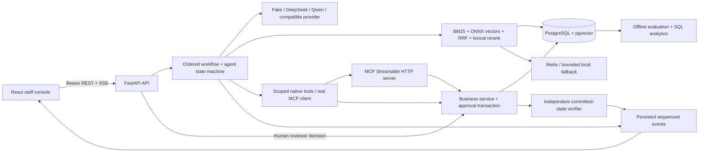

# Architecture and explicit boundaries

OpsPilot is a modular monolith for NovaMart **SIMULATED BUSINESS**. A real PostgreSQL transaction changes simulated business records; no payment gateway, carrier or real customer system is connected. Python 3.12/FastAPI serves REST and SSE; a mounted MCP SDK 2.2 server shares the business service layer. React/Vite is the staff console.

`business.py` is the invariant boundary, independent of the model. `tools.py` validates schemas, roles and conversation ownership before dispatch. `agent.py` stores only an auditable plan, observations, versions and public decision summaries. `registry.py` validates ordered workflow JSON and release evidence. `rag.py` parses, chunks, embeds and retrieves. `evals/` exercises these actual modules with isolated orders, rather than calculating a score from a canned response table.

State and process limitations are deliberate: one API process owns in-flight asyncio tasks. PostgreSQL persists events and waiting proposals, but queued/running work interrupted by restart becomes a visible failure requiring replay. This is not a durable distributed worker system. Redis is a best-effort retrieval cache, never the source of approvals, identity or money. Local rate limiting is process-scoped and must be replaced or augmented before multi-worker exposure.

The default model mode is a deterministic Fake provider for structured intent and extractive grounded responses. ONNX embeddings are genuinely executed. The DeepSeek adapter makes an authenticated, bounded JSON intent request; six actual API calls matched 5/6 authored labels in a separate [development smoke](real-model-results.md). The full agent benchmark still uses Fake, and no paid-model improvement is inferred from that harness score. Model interpretation never owns authorization or payment execution.

Future scale work begins with tenant isolation, SSO, role scoping, durable task leasing, approval expiry, migration/backup discipline and worker admission control; only measured bottlenecks justify service extraction. A million-user deployment is a design exercise, not a capacity claim.
