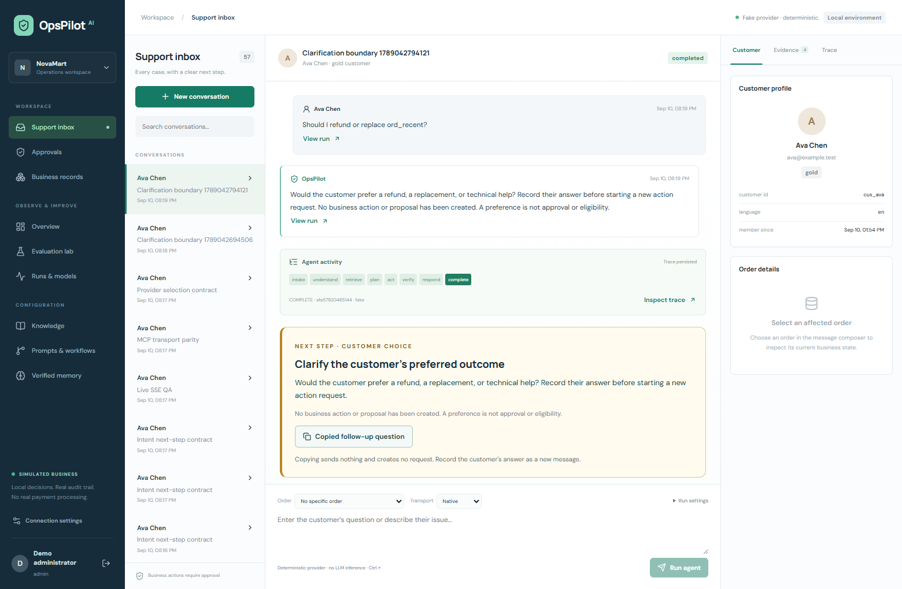

# Product upgrade: the next step matters more than valid JSON

## Research and scope, 2026-09-10

The [NeurIPS 2026 competition reviewer guidance](https://neurips.cc/Conferences/2026/CompetitionReviewerGuidelines) asks for clear success criteria, credible baselines, leakage safeguards, appropriate resources and agent-action risks. We use this as an evaluation design standard; this repository is not claiming an accepted entry or meeting a specific current submission deadline.

The [original τ-bench repository](https://github.com/sierra-research/tau-bench) evaluates conversations with tools and domain policy, and now points users to its newer successor for corrected tasks. We borrow the distinction between language output and operational result, not its datasets or leaderboard score. The [Ragas context precision definition](https://docs.ragas.io/en/stable/concepts/metrics/available_metrics/context_precision/) measures relevant evidence ordering; it is not an authorization or intent-quality metric.

The observed DeepSeek failure chose `policy_conflict` for a customer's unresolved refund/replacement choice. The existing agent only handled `ambiguous` explicitly; `policy_conflict` fell through to policy excerpts. A staff user therefore had no clear next action even though the model returned valid JSON. This upgrade gives unresolved goals and policy conflicts explicit, distinct next steps. Existing refund authorization remains independent.

## Freeze before inference

`evals/datasets/intent-contract-v1.json` contains eight development cases and sixteen new prospective test cases, including negation, missing order identifiers, policy questions, contradictory guidance, partial refunds and simultaneous incompatible remedies. It is AI-authored synthetic data and has not received independent human label review. Its author sees the test cases, so "test" does not mean a blinded independent benchmark. Cases and label definitions are frozen before the candidate prompt and paid calls; SHA-256 and a separate dataset commit bind the experiment.

Compare the existing general system prompt against the same prompt plus a versioned taxonomy. Evaluate exact category and the deterministic next-step disposition separately. Score missed clarification/review and unnecessary clarification separately from ordinary accuracy; a valid JSON response is not semantic success. No model judge can silently change the expected labels. Preserve every returned response, usage, latency and failed contract. Frozen test results will not be used to retune this version.

This round does not claim to fix the preserved RAG ranking regression (`rag_02`, hybrid rank 1 versus lexical rerank rank 4) or its weak no-answer behavior. Those require a separately frozen retrieval experiment.

## Actual product change

New runs snapshot intent taxonomy v2 separately from the prompt-registry version. `ambiguous` produces a customer-choice follow-up; `policy_conflict` produces a human-policy-review follow-up. Both persist an `intent.next_step` event and stop before business tools. Workflows placing even a ticket write before the intent node are rejected. Selected actions still require scoped eligibility, human approval and independent database verification.



The console offers a copyable question, not fabricated customer consent. Copying sends no message, creates no run and performs no refund. The actual customer's answer must be entered separately. The browser test executes the application handler and checks unchanged run IDs; only the OS clipboard boundary is stubbed.

## Actual paired DeepSeek result

[Unmodified API report](../evals/reports/intent-contract-paired-deepseek.json): **48 completed calls**, two prompts ×24 cases ×one repetition. Dataset commit `a2a355cebf870a0ff2954110c33334ca00016669`, LF hash `da5930dc578066e939e747041680b8aea34a36133af1543c00c4d6b06b1a01a0`. Execution records this parent with a dirty worktree and exact provider/contract/evaluator hashes, which match the subsequently committed source. No tuning or relabelling followed these outputs.

The **16 prospective test cases** below were visible to the AI-assisted author. This is not independent blinded testing, a competition leaderboard, customer accuracy or a statistically established gain.

| Test strategy | Correct category | Correct next step | Premature action candidates | Unnecessary interruptions |
| --- | --- | --- | --- | --- |
| Baseline prompt + previous workflow | 13/16 | 12/16 | 2 | 0 |
| Workflow only | 13/16 | 13/16 | 2 | 0 |
| Taxonomy only | 16/16 | 13/16 | 0 | 0 |
| Taxonomy + workflow | 16/16 | 16/16 | 0 | 0 |

The two workflow mappings reuse identical recorded responses, separating prompt effects from deterministic dispatch. Prompt order alternates across cases. A premature action candidate is a **predicted next step**, not an attempted proposal or transaction. The predeclared test gate passed; no transaction was executed by this evaluator.

Across **all 24 cases**, full contract success is **23/24**, not 100%. Candidate `dev05` still maps conflicting 30-day versus 14-day guidance to `knowledge_qa`, where the declared contract requires `policy_conflict → review`. The expectation was retained. This may also indicate a debatable taxonomy boundary; independent support-domain label review is needed.

Observed usage: **15,618 input / 2,039 output tokens**, returned model `deepseek-flash`, median provider latency **1,011.76 ms**. This is one developer connection's observation; cost remains null without an invoice. The routing evaluator runs no user simulator, RAG, database or business tools. No τ-bench or Ragas execution is claimed.

## Reproduce with a declared budget

After [server-only DeepSeek configuration](real-model-setup.md), run from the repository root:

```powershell
# Zero-call plan and dataset/configuration check.
python -m evals.intent_contract_eval --split all --max-calls 48 --output readiness.json
# Explicit paid run: at most 48 HTTP attempts, 512 default output tokens per call.
python -m evals.intent_contract_eval --execute --split all --max-calls 48 --output paired-run.json
```

An insufficient paired budget or changed dataset hash is rejected before HTTP. No retries; first provider failure stops the run; each row is checkpointed. Repetitions create new evidence, never overwrite the published run. Keys stay server-side and are excluded from reports.

## Verification and limits

Local **88 backend tests / zero skipped** against real PostgreSQL/MCP/SSE, **7 frontend unit tests**, lint/typecheck/build and the new actual-API clarification browser scenario passed. [Backend JUnit](../evals/reports/intent-contract-backend-junit.xml) · [Local browser result](../evals/reports/intent-contract-browser-local.json). Full nine-browser and Compose validation is tracked in the latest GitHub Actions run.

The existing 60-case Fake transaction harness was rerun separately: **59/60**, zero unsafe executed actions, original failure preserved. [Separate current report](../evals/reports/intent-contract-fake-harness.json). Clarification now accepts a persisted `next_step.kind=clarify` with no proposal, or the historical wording; the updated assertion is disclosed in that report. Historical reports were not overwritten.

Next: independent label review, new unseen paraphrases and repeated trials, a real-provider full-agent evaluation with isolated simulated orders, and a separate retrieval/rejection calibration experiment. Wrongly confident action categories can still miss clarification, so human approval and policy rechecks remain essential. This is not a complete production security claim.
